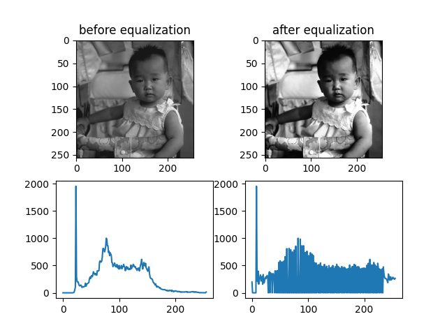
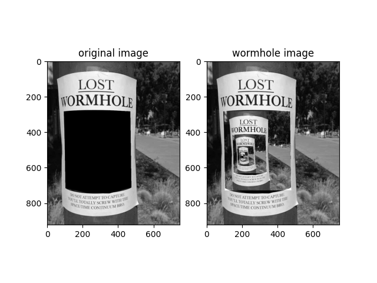
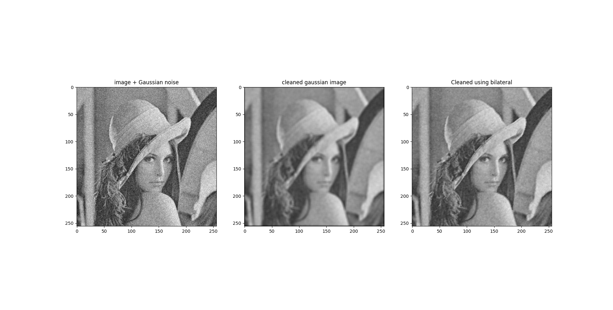
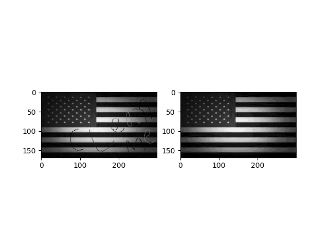
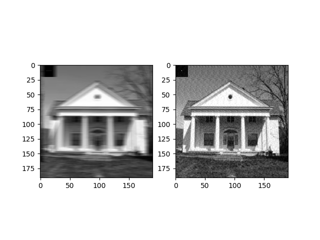
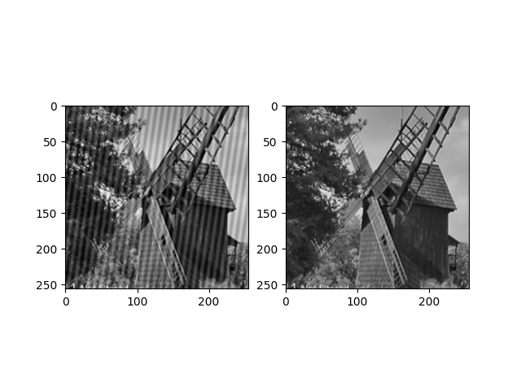
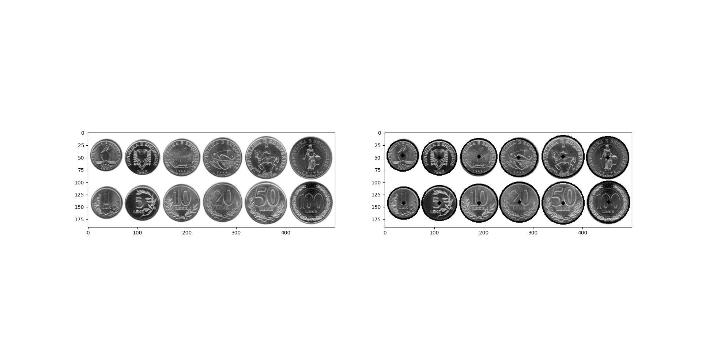
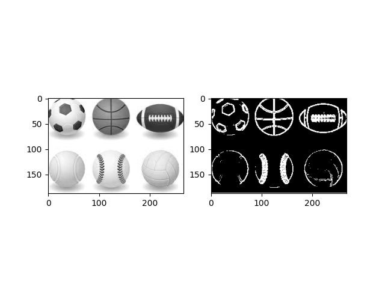

# Image-Processing-Homework

## A repo for Omer Escojido and Avishay Oz to do image processing homework

### Submission Summary

| Homework                                                | Deadline       | Done  | Grade |
| :---                                                    | :---:          | :---: | :---: |
| Homework 1 - Histograms                                 | 17.11.2022     | ✅   | 100   |
| Homework 2 - Geometric Operations                       | 10.12.2022     | ✅   | 100   |
| Homework 3 - Spatial Operations                         | 24.12.2022     | ✅   | 100   |
| Homework 4 - Frequency Operations/Image Restoration     | 7.1.2023       | ✅   | 100   |
| Homework 5 (Last) - Edge Detection/Hough Transform      | 22.1.2023      | ✅   | 100   |

### Highlights

